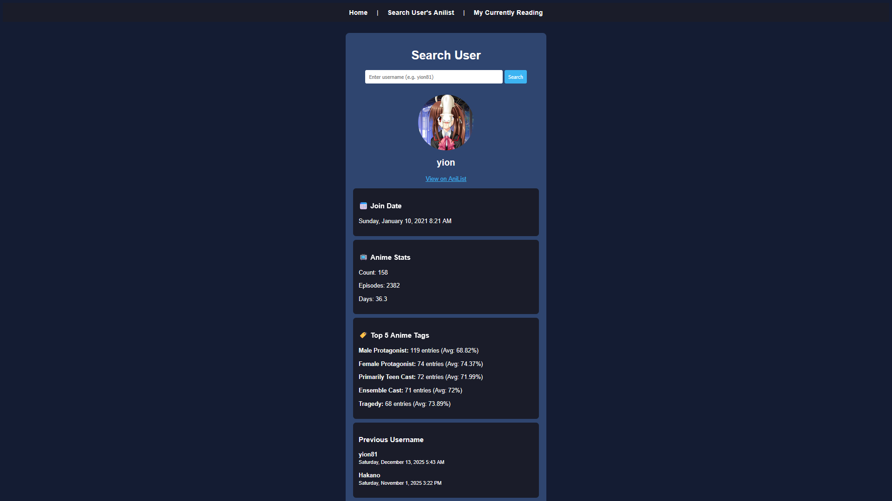
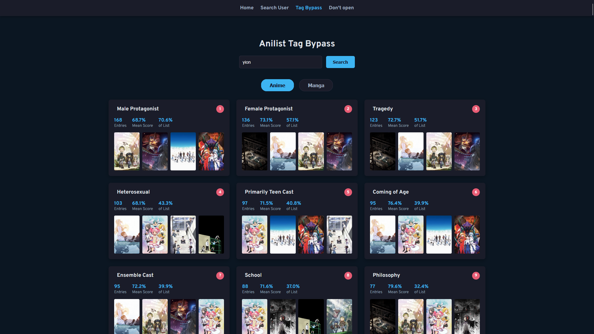

# 🎬 AniList Web Tracker

A dynamic web application built with **Laravel (PHP)** that integrates with the **AniList GraphQL API**. This project demonstrates Backend Engineering concepts including MVC architecture, third-party API consumption, and robust error handling.

> **Status:** Active / Learning Project  
> **Live Demo:** [Click Me](https://anilist-api-pull-production.up.railway.app/)

## 🚀 Key Features

* **User Profile Search:** Fetch real-time user data including avatars, bio, and watch statistics.
* **Manga Tracking Dashboard:** A grid layout displaying "Currently Reading" manga with progress bars and cover art.
* **Dynamic Data Fetching:** Uses raw GraphQL queries sent via Laravel's HTTP Client.
* **Robust Error Handling:** gracefully handles API timeouts and empty states (e.g., users with no history).
* **Responsive UI:** Custom CSS Grid layout for manga cards and profile stats.

## 🛠️ Tech Stack

* **Backend:** PHP 8.x, Laravel Framework
* **API:** AniList GraphQL API
* **Frontend:** Blade Templates, CSS3 (Custom Grid/Flexbox)
* **Tools:** Composer, Git, VS Code

## 📸 Screenshots

| User Search Profile | Manga Progress Dashboard |
|:-------------------:|:------------------------:|
|  |  |

## ⚙️ How to Run Locally

If you want to clone and run this project on your own machine:

1.  **Clone the repository**
    ```bash
    git clone [https://github.com/yion81/anilist-app.git](https://github.com/yion81/anilist-app.git)
    cd anilist-app
    ```

2.  **Install Dependencies**
    ```bash
    composer install
    ```

3.  **Environment Setup**
    ```bash
    cp .env.example .env
    php artisan key:generate
    ```

4.  **Run the Server**
    ```bash
    php artisan serve
    ```

5.  **Visit the App**
    Open `http://localhost:8000` in your browser.

## 🧠 What I Learned (Technical Highlights)

This project was built to transition from Vanilla PHP to a structured Framework environment. Key learnings include:

* **MVC Architecture:** Separating logic (Controllers) from presentation (Blade Views) and routing.
* **API Integration:** Moving from verbose `cURL` to Laravel's fluent `Http` client.
* **Data sanitization:** Using Blade's `{{ }}` syntax to prevent XSS attacks compared to `echo`.
* **GraphQL:** Writing and structuring complex queries to fetch nested JSON data (Media -> Title -> English/Romaji).

## 📝 License

This project is open-source and available under the [MIT license](https://opensource.org/licenses/MIT).